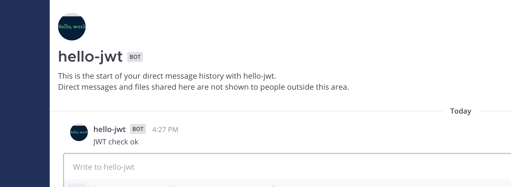

This quick start guide will walk you through the basics of using [JSON Web Tokens (JWT)](https://jwt.io/) in a Mattermost app in Go. In this guide you will review an app that:

- Contains a `manifest.json`, declares itself an HTTP application that acts as a bot and uses JWT, and attaches to locations in the Mattermost interface.
- Attaches the `send` function to a `/hello-jwt` command and wraps it with an function to authenticate JWT.

## Prerequisites

Before you can start with your app, you first need to set up your environment by following the [developer setup guide]().

You also need at least `go1.16` installed. Please follow the [official guide](https://golang.org/doc/install) to install the latest version.

## Download and start the app

In the same [mattermost-app-examples repository](https://github.com/mattermost/mattermost-app-examples) you cloned via the [developer setup guide]() above, navigate to the `golang/jwt` directory and start the Docker compose:

```sh
cd golang/jwt
docker compose up
```

You'll see Docker install the Go modules and then the app will come online and print the following message:

```
Use '/apps install http http://mattermost-apps-golang-jwt:8084/manifest.json' to install the app
Use "1234" as the app's JWT secret
```

## Install the app on Mattermost

Next, access your development Mattermost server at [http://localhost:8065](http://localhost:8065) and use the `/apps install http http://mattermost-apps-golang-jwt:8084/manifest.json` slash command to install the JWT app. Select `Agree to grant the app access to APIs and Locations`, enter the JWT secret (1234), and click `Submit` to finish the installation.

## Use the app

You can now use the `/hello-jwt send` command. This will cause the app's bot user to DM you a response:



## Review the app

To understand the app, examine the following elements:

### Manifest

The app must provide a manifest, which declares app metadata. In this example, the following permissions are requested via the `/manifest.json` endpoint:

- Create posts as a bot.
- Create slash commands.
- Use JWT.

### Bindings and locations

Locations are named elements in the Mattermost user interface. Bindings specify how an app's calls should be displayed and invoked from these locations.

The app creates a `/hello-jwt send` slash command that checks the validity of the JWT.

### Functions

Functions handle user events and webhooks. The JWT app relies on one main function:

- `send` that services the command and modal. This function is wrapped with `withJWT` that requires JWT, which calls `checkJWT` to verify the provided token.

### Assets

Apps may include static assets. Only one asset is used in this example for this app, `icon.png`. Static assets must be served under the `static` path.

## Uninstall the app

Once you're done with the app, you can uninstall it via the `/apps uninstall hello-jwt` slash command. Alternatively, you can use `/apps debug clean` to remove all data for all installed apps.

To stop and clean up the app from Docker after you're done, use the following command in the `golang/jwt` directory:

```sh
docker compose down
```

## Conclusion

You now know how to create a Mattermost app in Go. If you have questions about building apps or want to show off what you're building, join us on the [Integrations & Apps channel in the Mattermost Community server](https://community.mattermost.com/core/channels/integrations)!
