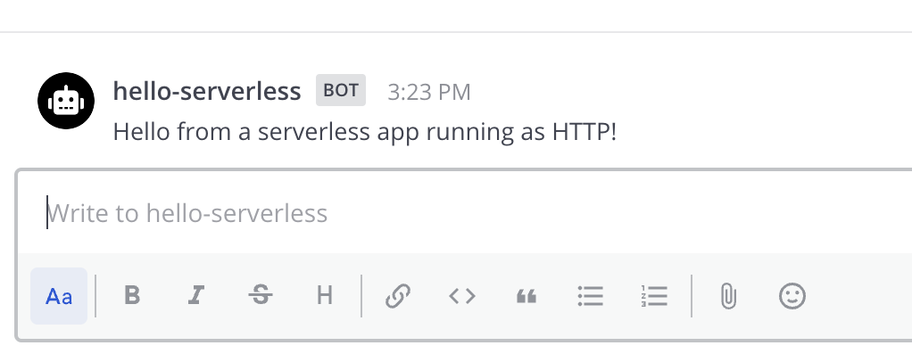

This quick start guide will walk you through the basics of using creating a serverless Mattermost app in Go on AWS or OpenFaaS. In this guide you will review an app that:

- Contains a `manifest.json`, declares itself an HTTP application that acts as a bot, uses webhooks, and attaches to locations in the Mattermost interface.
- Attaches `send` function to a `/hello-serverless` command, accepting an optional `message` argument.

This app will focus on the functionality of the actual serverless app in this example. For more information about [how to package a Mattermost app for serverless deployments](), [how to deploy a Mattermost app to AWS](), or [how to deploy a Mattermost app to OpenFaaS]() please refer to the corresponding guides.

## Prerequisites

Before you can start with your app, you first need to set up your environment by following the [developer setup guide]().

You also need at least `go1.16` installed. Please follow the [official guide](https://golang.org/doc/install) to install the latest version.

## Download and start the app

In the same [mattermost-app-examples repository](https://github.com/mattermost/mattermost-app-examples) you cloned via the [developer setup guide]() above, navigate to the [`golang/serverless`](https://github.com/mattermost/mattermost-app-examples/tree/master/golang/serverless) directory and start the Docker compose:

```sh
cd golang/serverless
docker compose up
```

The `docker-compose.yml` uses the [HTTP deployment]() of the serverless app for the sake of trying it out locally. You'll see Docker install the Go modules and then the app will come online and print the following message:

```
Install via /apps install http http://mattermost-apps-golang-serverless:8080/manifest.json 
```

## Install the app on Mattermost

Next, access your development Mattermost server at [http://localhost:8065](http://localhost:8065) and use the `/apps install http http://mattermost-apps-golang-serverless:8080/manifest.json ` slash command to install the webhooks app. Select `Agree to grant the app access to APIs and Locations` and click `Submit` to finish the installation.

## Use the app

You can now use the `/hello-serverless send` command with an optional `message` argument. This will cause the app's bot user to DM you a response:



If you included `message` in the slash command, that would also be included in the response.

## Review the app

To understand the app, examine the following elements:

### Manifest

The app must provide a manifest, which declares app metadata. In this example, the following permissions are requested via the `/manifest.json` endpoint:

- Create posts as a bot.
- Create slash commands.

### Bindings and locations

Locations are named elements in the Mattermost user interface. Bindings specify how an app's calls should be displayed and invoked from these locations. This app uses only uses the slash command location.

### Functions

Functions handle user events and webhooks. The webhooks app uses only one main function via a slash command:

- `/hello-serverless send` slash command with an optional `message` argument that sends DMs the user's channel via the app bot.

All of the logic for the serverless app can be found in `golang/serverless/function/handler.go`, which is the shared function file across all deployment types (HTTP, AWS, and OpenFaaS) for this app. In this file you can review the `send` function that corresponds with the above slash command via a binding. The binding contains a `form` with a `submit` function that sends an interpolated message back to the user. As a slash command, the form's one optional `message` will be collected as an argument from the user's command.

### Assets

Apps may include static assets. Only one asset is used in this example for this app, `icon.png`. Static assets must be served under the `static` path.

## Uninstall the app

Once you're done with the app, you can uninstall it via the `/apps uninstall hello-serverless` slash command. Alternatively, you can use `/apps debug clean` to remove all data for all installed apps.

To stop and clean up the app from Docker after you're done, use the following command in the `golang/serverless` directory:

```sh
docker compose down
```

## Explore serverless deployments

Now that you've examined the app in HTTP mode, you can next look at deploying them to your desired serverless plaform. Check out the guides on [how to deploy a Mattermost app to AWS]() or [how to deploy a Mattermost app to OpenFaaS](), depending on which platform you're targeting.

## Conclusion

You now know how to create a Mattermost app in Go. If you have questions about building apps or want to show off what you're building, join us on the [Integrations & Apps channel in the Mattermost Community server](https://community.mattermost.com/core/channels/integrations)!